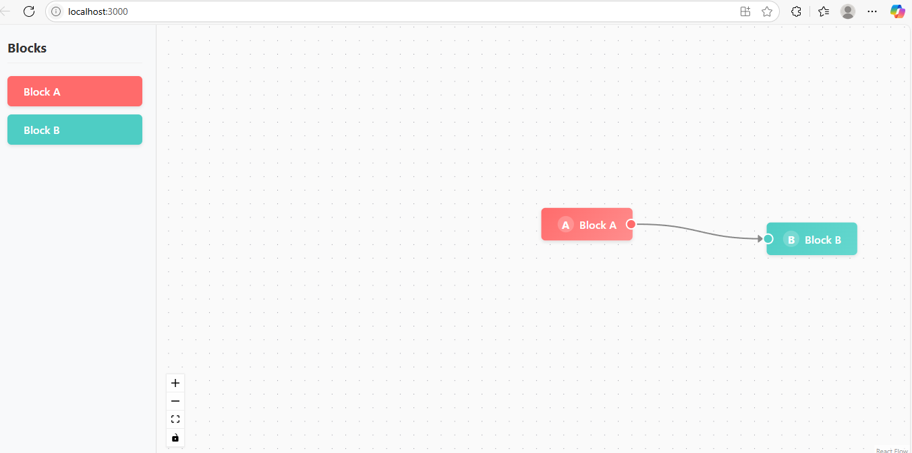

# React Flow Interactive Board

Live Demo:  https://react-flow-task-eight.vercel.app/



A drag-and-drop interface for creating and connecting nodes with custom business rules.

## ✨ Features

- **Drag-and-drop** nodes from sidebar to canvas
- **Connection validation** (Block A → Block B only)
- **Right-click context menu** on nodes
- **Visual feedback** for connections and selections
- **Responsive design** works on desktop/tablet

## 🚀 Quick Start

### Prerequisites
- Node.js v16+
- npm v8+ or yarn

### Installation
```bash
git clone https://github.com/your-username/react-flow-task.git
cd react-flow-task
npm install


# Development mode (http://localhost:3000)
npm start

# Production build
npm run build

# Run tests
npm test


src/
├── components/
│   ├── BlockA.jsx       # Custom Block A component
│   ├── BlockB.jsx       # Custom Block B component
│   ├── BlockPanel.jsx   # Draggable blocks sidebar
│   ├── FlowCanvas.jsx   # Interactive canvas area
│   └── NodeMenu.jsx     # Context menu implementation
├── App.jsx              # Main application component
└── styles/              # CSS modules


📜 License
MIT © nitesh 2023

📧 Contact: mandalnitesh654@gmail.com
🐛 Report Issues: GitHub Issues
